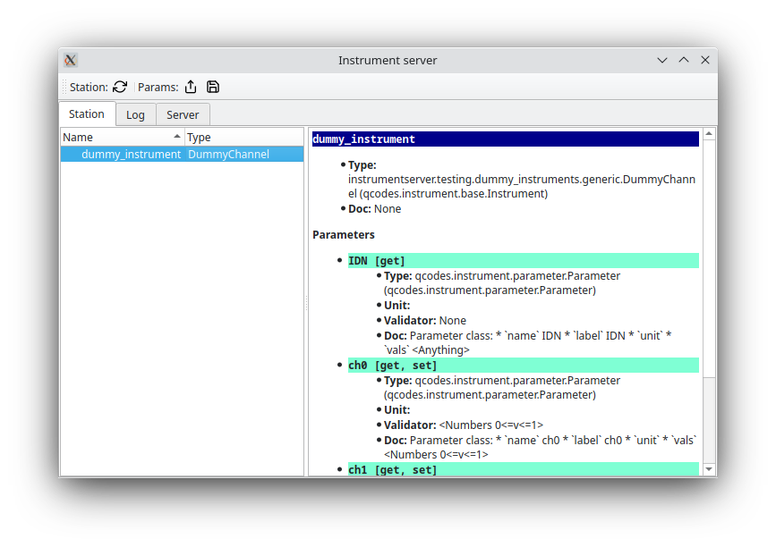

Basic Usage
===========

Installation
------------

At the moment `instrumentserver` is not on pip or conda so the only way of installing it is to install it from github directly.
To do that first clone the `github repo <https://github.com/toolsforexperiments/instrumentserver>`__,
and install into the desired environment using the
`editable pip install <https://pip.pypa.io/en/stable/cli/pip_install/#cmdoption-e>`_.

.. _instrumentserver essential tools:

Quick Overview
--------------

To open the instrument server we simple run the command on a terminal:

.. code-block:: console

    $ instrumentserver

This will open the GUI of the server and start running it.

.. image:: img/empty_server.png

.. note::
    The server can be run without a gui by passing the --gui False argument.
By default, instrumentserver listens to the local host IP address (127.0.0.1) and the port 5555. To be able to communicate
with the server through other devices in the network we have to specify the IP address we want the server to listen to.
For this we pass the argument -a <IP_address> and -p <port_number>:

.. code-block:: console

    $ instrumentserver -a 192.168.1.1 -p 12345

This will make the server listen to both the local host and the IP address 192.168.1.1 with port 12345.

We communicate with the server with Python code. This can be done anywhere that python can run, an IPython console, a Jupyter notebook, etc.
The easiest way of creating :class:`Client <instrumentserver.client.proxy.Client>` and
running the :func:`create_instrument() <instrumentserver.client.proxy.Client.create_instrument>` method.

.. note::
    Remember to pass the instrument specific arguments and keyword arguments necessary for the specific QCoDeS instrument
    you are trying to open.

This will look for the specified instrument with the given name in the server or create it if the instrument does not
exist, and return it:

>>> cli = Client()
>>> dummy_instrument = cli.create_instrument(instrument_class='instrumentserver.testing.dummy_instruments.generic.DummyChannel', name='dummy_instrument')

.. note::
    If we are trying to talk to a server running in a different device in the network we need to specify the IP address
    and port with the arguments host and port when creating the :class:`Client <instrumentserver.client.proxy.Client>`.

After this we can see that the instrument has been created in the server.

After that we can use the instrument like a normal QCoDeS instrument. We can create a :class:`Client <instrumentserver.client.proxy.Client>`
from any process and get the dummy_instrument by simply using the :func:`get_instrument() <instrumentserver.client.proxy.Client.get_instrument>` method:

>>> dummy_instrument = cli.get_instrument(name='dummy_instrument')

