Plottr apps
===========

Predefined apps
---------------

Autoplot
^^^^^^^^

.. automodule:: plottr.apps.autoplot
    :members:

Monitr
======

Monitr is a file monitoring app that updates in real time showing every measurement in the monitoring folder. In monitr you can directly open plots to see your data, select favorite items, filter items and add images and comments to your data.

How to Open Monitr
------------------

Monitr is designed to monitor all subdirectories created inside the monitoring directory. We open Monitr from a Linux terminal with the command:

.. code-block:: console

    $ plottr-monitr <monitoring-directory>

From a Windows terminal:

.. code-block:: console

    $ plottr-monitr.exe <monitoring-directory>

The command will start the file monitoring and the main window will open:

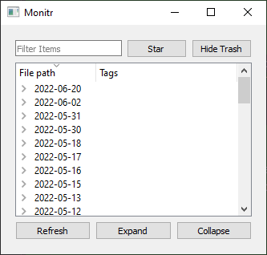

The main window will display all :ref:`Datasets`, or directories containing datasets, that lives inside the monitoring directory and will keep updating itself in real time, showing any new datasets, deleting them when the files are deleted, and changing the names of them when necessary.

Datasets
--------

At the moment we define a folder as a dataset if it contains either a ddh5, markdown or json file inside of it. This is defined in the :meth:`SupportedDataTypes <plottr.plottr.apps.monitr.SupportedDataTypes>` object. If any file directory passes a regex matching with these file types, its parent folder is considered a dataset.

.. note:: If a directory lives inside of the monitoring directory but does not contain any of the three file types, or it doesn't have a folder that has them, the folder will not show in the main file tree.

Main Window (File Explorer)
---------------------------

The following is an example taken from a real data folder.

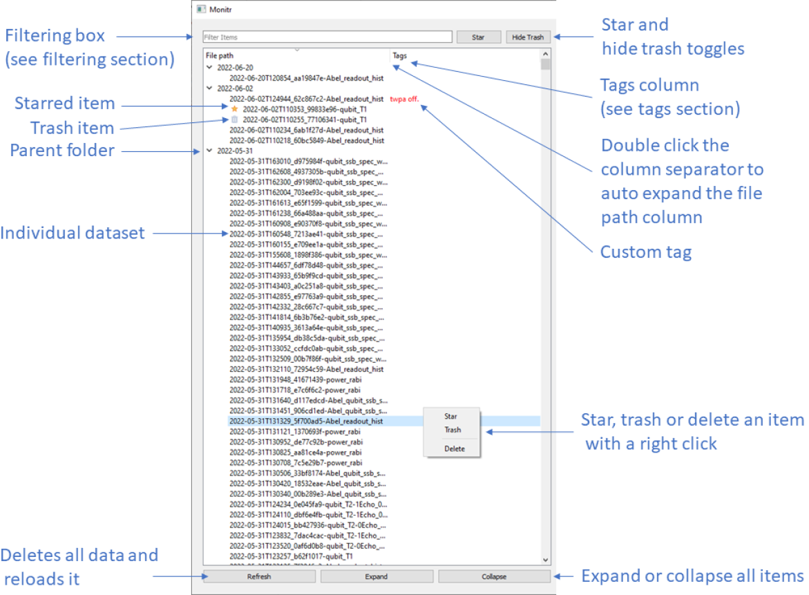

Basic Control And Usability
^^^^^^^^^^^^^^^^^^^^^^^^^^^

Selecting an item, either by clicking on it or selecting it with the arrow keys, will open the :ref:`right side window`. If you select an item that contains children, the right side window will contain all of the information of the selected item and all of its children:

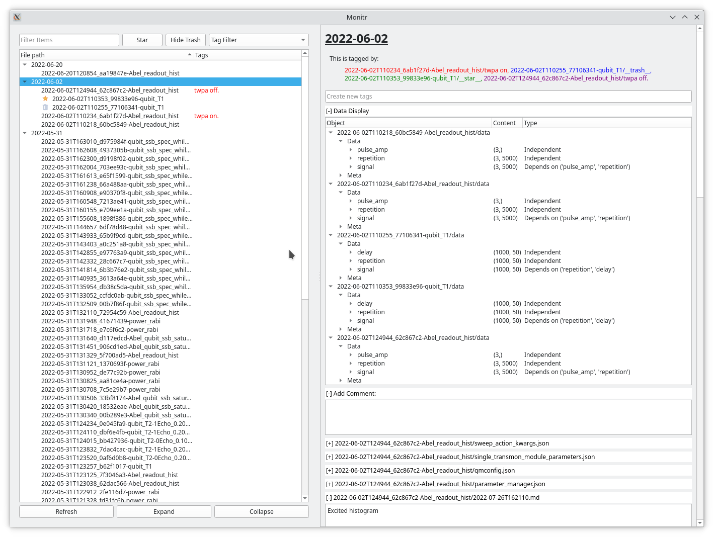

The following are a few things that the window can do:
    * You can resize the File Path column to show the complete name of all shown items, double click in the column separator.
    * You can rename any selected item by double clicking on its name or pressing F2 to change the currently selected item
    * Clicking on the collapse or extend bottom buttons will collapse or extend all currently showing items in the tree.
    * You can change the order in which the items are sorted (alphabetically or reverse alphabetically by clicking in the File Path column header.

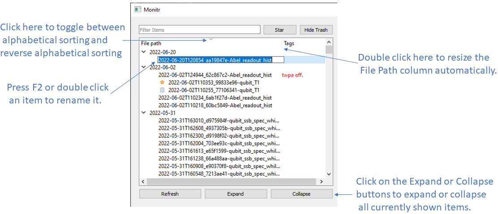

Tags
^^^^

Monitr supports user created tags. Any file whose name end with ".tag" is considered a tag, and its file name becomes the text of the tag. In the overview "twpa off" is a custom tag, the folder 2022-06-02T124944_62c867c2-Abel_readout_hist contains the file "twpa off.tag". All custom tags will appear in the tags column and they can be used for custom :ref:`filtering`. You can create new tags with the tag creator (see :ref:`Tags Display and Tag Creator` or by simply adding a .tag file in a dataset folder). Two special tags exists: "__star__.tag" and "__trash__.tag", these will add icons to your items and have dedicated filtering buttons. The trash tag is the only tag that can be used to hide items.

Filtering
^^^^^^^^^

You can filter utilizing the "Filter Items" entry. All our filtering occurs by regex matching. When filtering, Monitr will show parent items if they contain children that match the filter requirements (even if the parent itself does not match). You can stack multiple searches using commas and only items that match with all of the queries will be shown.

For example, if looking for "readout_hist" in our example, only items whose path match with that text will show up:

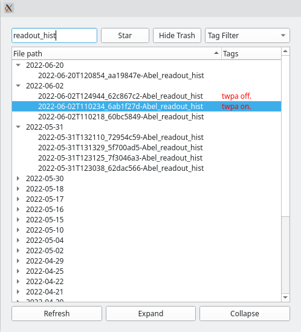

Filtering by tags can also be done through the tag filtering widget. Monitr keeps track of all the existing custom tags and lets you select them in the tag filtering widget.

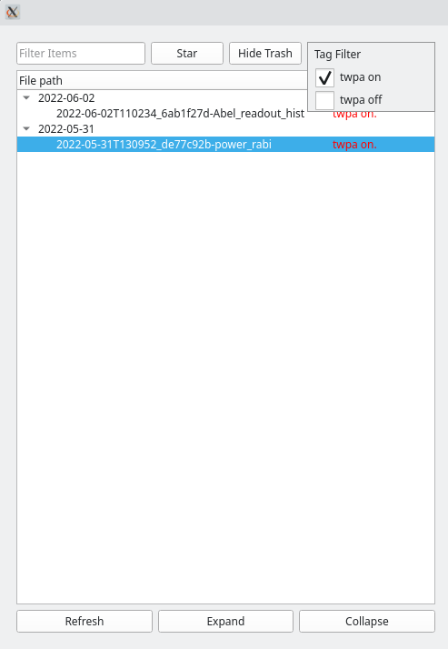

We can also filter through files inside of the item folder, like their tag names or image names:

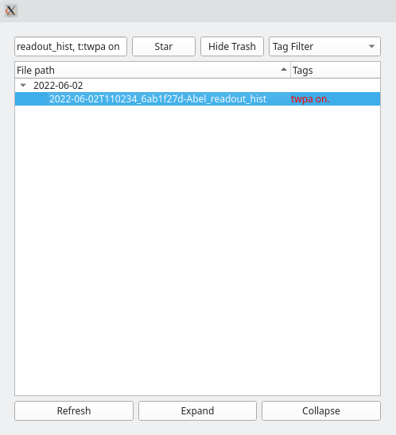

Like this we can combine as many searches for all five of our currently supported search types.

Monitr supports filtering for:

    * Paths of datasets: Just write your query and all items whose entire paths match with the query will be shown.

    * Tags: Start the queries with: "t:", "T:", or "tag:" directly followed by the tag you want to filter.

    * Markdown files: Start the queries with: "m:", "M:", or "md:" directly followed by the text you want to filter. This will look inside of all folders inside of the monitoring directory and show only the datasets that contain a markdown file whose name matches with the query.

    * Images: Start the queries with: "i:", "I:", or "image:" directly followed by the text you want to filter. This will look inside of all folders inside of the monitoring directory and show only the datasets that contain an image file whose name matches with the query.

    * Json: Start the queries with: "j:", "J:", or "json:" directly followed by the text you want to filter. This will look inside of all folders inside of the monitoring directory and show only the datasets that contain a markdown file whose name matches with the query.

Star and Trash Items
^^^^^^^^^^^^^^^^^^^^

You can star or trash items by right clicking on them and clicking on the star or trash button. This will create a tag file inside of that folder ("__star__.tag" or "__trash__.tag"), which indicates that that item is either a starred item or a trashed item. If you right click on an already starred/trashed item, an option to un-star or un-trash will appear instead.

The star and hide trash buttons (top right buttons of the main window picture) allow to toggle the two special filters corresponding to these special tags:

    * Star: If this button is toggled, only starred items (or parents of starred) will be shown:

        .. image:: img/star_toggle.png

    * Hide trash: Hides all trash items.

.. note::
    The star and trash toggle buttons prioritize the parents status before their children. This means that if a parent folder (a folder containing datasets) is starred, all of its children will also be starred. In the same way, if a parent folder is trash and the hide trash is activated, all of its children will also be hidden.

Right Side Window
-----------------

When clicking on a dataset, the right side window will get populated with the files that are inside of it.

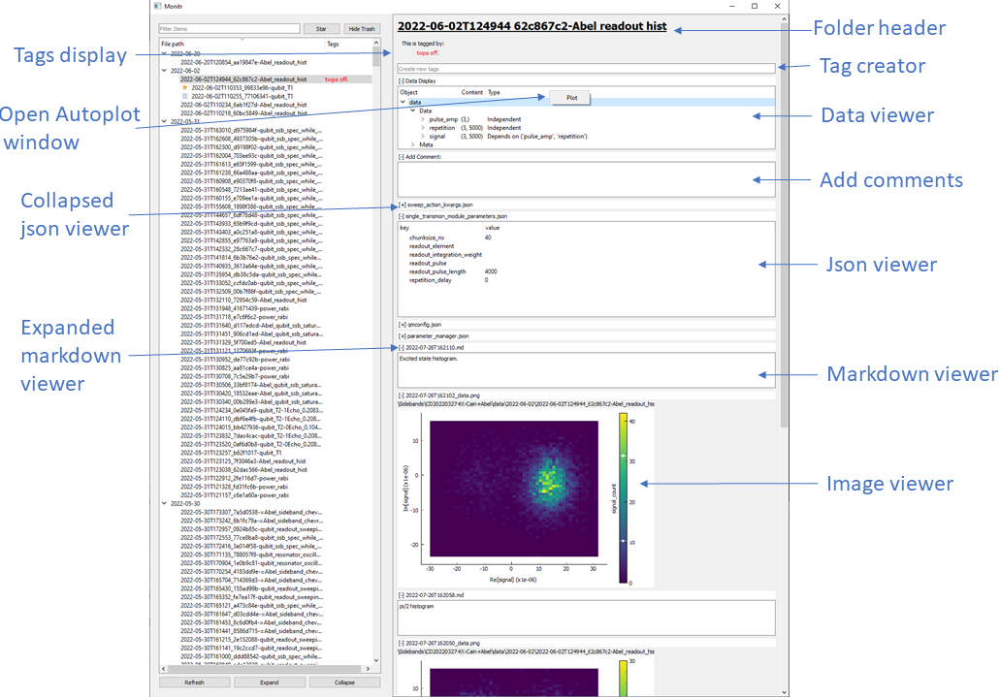

From the right side window you can open an autoplot window to plot the data of any data file that lives inside of that dataset.

All viewer widgets (expect the dataset header, the tags display, and the tag creator) live inside collapsible windows. These windows can be collapsed to hide them.

Tags Display and Tag Creator
^^^^^^^^^^^^^^^^^^^^^^^^^^^^

Under the file header you will see the tags display. In it, all tags that are tagging that dataset will appear with different colors.

Under the tag display, the tag creator is located. To create new tags simply type the tag in the line tag with the text: "Create new tags" and press enter. You can add multiple tags at a time by separating them with a coma:

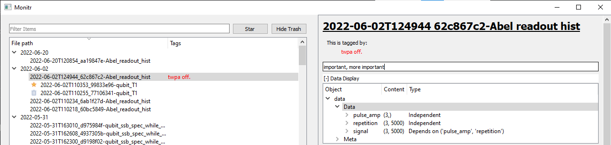

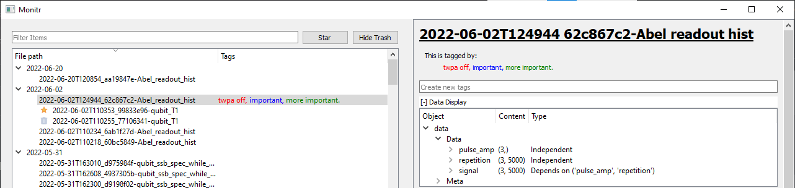

Data Viewer
^^^^^^^^^^^

If there is any valid data file in the selected dataset, the data viewer window will appear under the tag creator. All valid data files will appear as individual entries in that tree, including data files that are in folders inside the selected item (these will appear with the name of the folder before the file name).

To open an Autoplot window you have to right click in the file name line to open the plotting context menu.

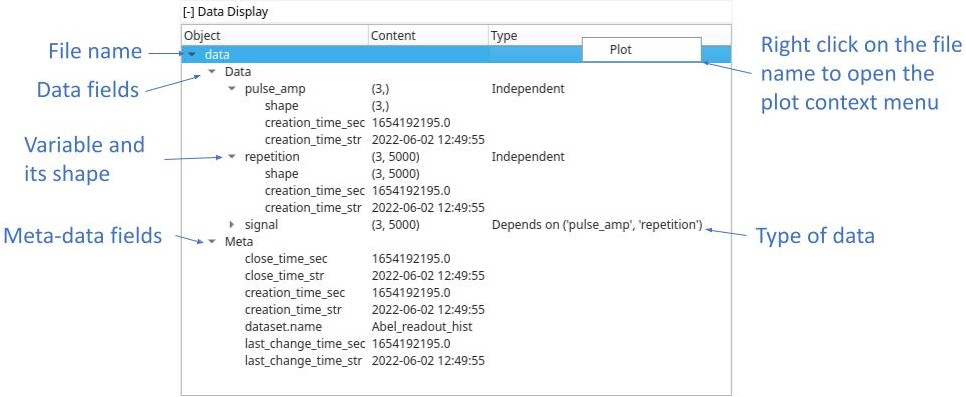

Extra Files Viewers
^^^^^^^^^^^^^^^^^^^

All extra files are displayed under the comment creator (more on it later) and are ordered in alphabetical ordered. This is so that if the files have the correct time stamp at the beginning of their name they will appear from newest to oldest.

Monitr will display three different kinds of files:

    * Json files: Json files will be displayed in a tree structure. They start collapsed by default.
    * Image files: Currently Monitr only works with JPG or PNG file types. Images start expanded by default.
    * Markdown files: We use markdown files for our comments. You can edit comments from Monitr by hovering in a comment window and clicking the edit button that will appear when hovering over it. Once you are done with your edit, the button will transform into a save button.

You can create new comments from the comment creator, just write the comment and click on the save button. A small dialog will appear when this happen asking for a file name. All comments created with this method will have a time stamp in their name before their given name. If the dialog is left empty, the comment will only have a time stamp as its file name.

If utilizing the pyqtgraph backend for autoplot, new images with the correct time stamp can be created by clicking the "Save Figure" button at the bottom toolbar. These images will be saved in the same folder as the DDH5 file automatically.

